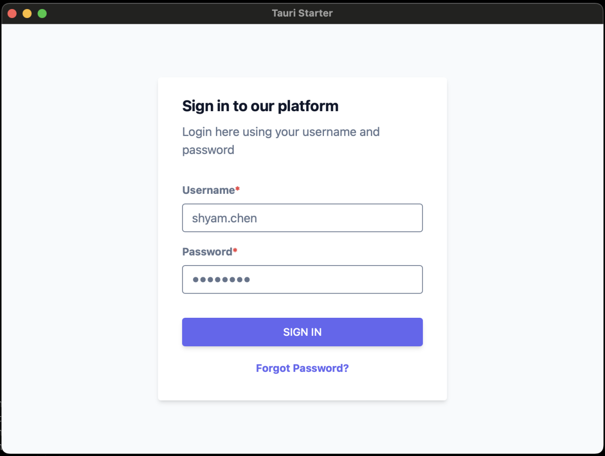
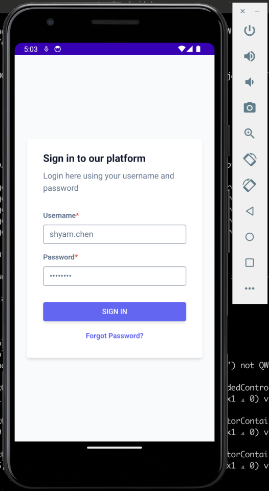
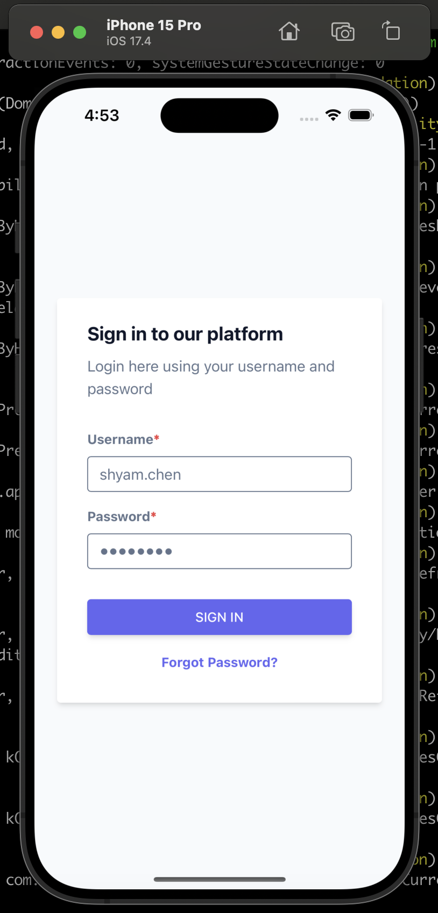

# Tauri Starter

:link: A boilerplate for Native App with Tauri, Vue, and Tailwind on Vite.

:rainbow: View Demo: [Live](https://vue-starter-6fa6.onrender.com) | Windows | macOS | Android | iOS

:octocat: Source Code: [Web-side](https://github.com/Shyam-Chen/Vue-Starter) | [Native-side](https://github.com/Shyam-Chen/Tauri-Starter) | [Server-side](https://github.com/Shyam-Chen/Fastify-Starter)

## Table of Contents

- [Getting Started](#getting-started)
- [Project Setup](#project-setup)

## Getting Started

Prerequisites:

- Node.js version 20
- PNPM version 8
- [Tauri version 2](https://beta.tauri.app/guides/prerequisites/)

Get started with Tauri Starter.

```sh
# install dependencies
$ pnpm install

# dev server (in one terminal)
# the default is to run it on macOS
$ pnpm dev:mobile
# or
$ pnpm dev:desktop

# mock server (in another terminal)
$ pnpm mock
```

Or use barebones scaffolding for your new Tauri app

```sh
$ pnpm dlx degit Shyam-Chen/Starter-Templates/tauri my-tauri-app
```

## Project Setup

Follow steps to execute this boilerplate.

### Web

Please refer to the upstream [repository](https://github.com/Shyam-Chen/Vue-Starter).

### Windows/macOS



```sh
$ pnpm tauri dev
```

```sh
$ pnpm tauri build
```

### Android



```sh
$ cd Library/Android/sdk/ndk/
$ ls
# 26.2.11394342

export NDK_HOME="$ANDROID_HOME/ndk/26.2.11394342"
```

```sh
$ pnpm tauri android init
$ pnpm tauri android dev
# select emulator
```

```sh
$ pnpm clean:android
$ pnpm tauri android init
$ pnpm tauri android build
```

### iOS



```sh
$ sudo xcode-select -s /Applications/Xcode.app/Contents/Developer
$ xcrun -f devicectl
```

```sh
$ pnpm tauri ios init
$ pnpm tauri ios dev
# select emulator
```

```sh
$ pnpm clean:ios
$ pnpm tauri ios init
$ pnpm tauri ios build
```
